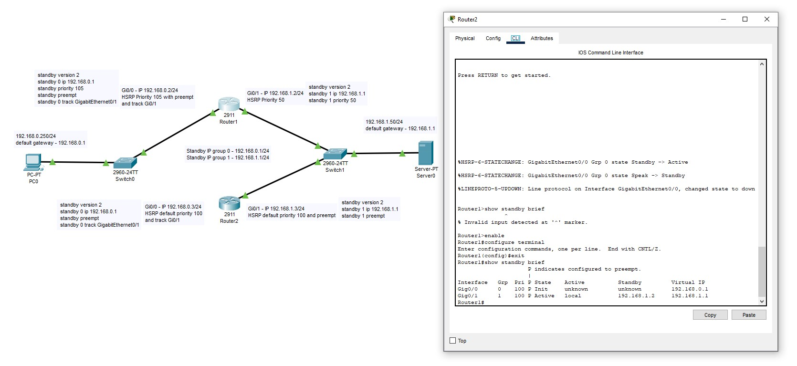
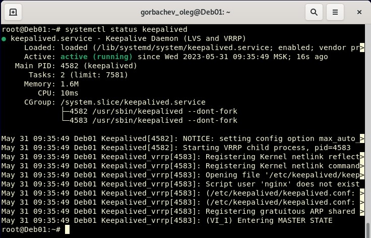

# Домашнее задание к занятию 1 «Disaster recovery и Keepalived» - `Горбачев Олег`

### Цель задания
В результате выполнения этого задания вы научитесь:
1. Настраивать отслеживание интерфейса для протокола HSRP;
2. Настраивать сервис Keepalived для использования плавающего IP

------

### Чеклист готовности к домашнему заданию

1. Установлена программа Cisco Packet Tracer
2. Установлена операционная система Ubuntu на виртуальную машину и имеется доступ к терминалу
3. Сделан клон этой виртуальной машины, они находятся в одной подсети и имеют разные IP адреса
4. Просмотрены конфигурационные файлы, рассматриваемые на лекции

------

### Задание 1
- Дана схема для Cisco Packet Tracer, рассматриваемая в лекции.
- На данной схеме уже настроено отслеживание интерфейсов маршрутизаторов Gi0/1 (для нулевой группы)
- Необходимо аналогично настроить отслеживание состояния интерфейсов Gi0/0 (для первой группы).
- Для проверки корректности настройки, разорвите один из кабелей между одним из маршрутизаторов и Switch0 и запустите ping между PC0 и Server0.
- На проверку отправьте получившуюся схему в формате pkt и скриншот, где виден процесс настройки маршрутизатора.
------
### Решение 1
в данной схеме на Router2 прописываем:
```shell
enable
```
```shell
configure terminal
```
```shell
exit
```
```shell
show standby brief
```

[Итоговая схема](10.1-1.pkt)

*Приоритет сменился с 50 на 100*


------

### Задание 2
- Запустите две виртуальные машины Linux, установите и настройте сервис Keepalived как в лекции.
- Настройте любой веб-сервер (например, nginx или simple python server) на двух виртуальных машинах
- Напишите Bash-скрипт, который будет проверять доступность порта данного веб-сервера и существование файла index.html в root-директории данного веб-сервера.
- Настройте Keepalived так, чтобы он запускал данный скрипт каждые 3 секунды и переносил виртуальный IP на другой сервер, если bash-скрипт завершался с кодом, отличным от нуля (то есть порт веб-сервера был недоступен или отсутствовал index.html). Используйте для этого секцию vrrp_script
- На проверку отправьте получившейся bash-скрипт и конфигурационный файл keepalived, а также скриншот с демонстрацией переезда плавающего ip на другой сервер в случае недоступности порта или файла index.html
------

### Решение 2
*Последовательно выполняем команды*
```shell
sudo apt-get install keepalived
```
```shell
sudo nano /etc/keepalived/keepalived.conf
```
*На первой ВМ*
```shell
vrrp_instance VI_1 {
        state MASTER
        interface enp0s3
        virtual_router_id 15
        priority 255
        advert_int 1

        virtual_ipaddress {
              192.168.1.115/24
        }

}
```
*На Второй ВМ*
```shell
vrrp_instance VI_1 {
        state BACKUP
        interface enp0s3
        virtual_router_id 15
        priority 255
        advert_int 1

        virtual_ipaddress {
              192.168.1.115/24
        }

}
```
```shell
systemctl enable keepalived
```
```shell
systemctl start keepalived
```
```shell
systemctl status keepalived
```




